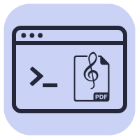

<div align="center">

<picture>
  <source media="(prefers-color-scheme: dark)" srcset="docs/assets/logo-light.svg">
  <source media="(prefers-color-scheme: light)" srcset="docs/assets/logo-dark.svg">
  
</picture>

# noten-tools

CLI-Tools für die digitale Notenarchiv-Verwaltung im sinfonischen Blasorchester.

</div>

> **Hinweis:** Ich bin kein professioneller Entwickler, sondern Notenwart. Dieses Projekt ist mit Unterstützung von KI-Assistenten entstanden — Code-Qualität und Architektur können entsprechend Lücken haben. Bug-Reports und Verbesserungsvorschläge sind ausdrücklich willkommen.

## 📚 Dokumentation

Vollständige Doku: **<https://janmw.github.io/noten-tools/>**

## 📦 Schnellinstallation

```bash
git clone https://github.com/janmw/noten-tools.git
cd noten-tools
./install.sh
```

## 📄 Lizenz

MIT — siehe [LICENSE](LICENSE).
