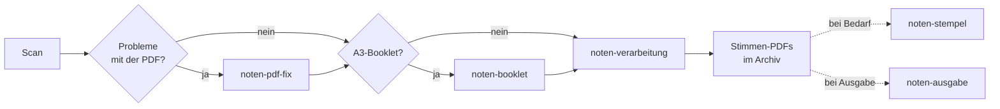

# Anwendung

Sieben Befehle, die ineinander greifen. Jeder ist auch einzeln nutzbar — die typische Pipeline ist aber:

## Aufgaben-Übersicht

| Aufgabe | Befehl | Anleitung |
|---|---|---|
| Notensatz in einzelne Stimmen splitten + stempeln | `noten-verarbeitung` | [Notensatz aufbereiten](notensatz.md) |
| A3-Booklet-Scan in A4 in richtiger Reihenfolge | `noten-booklet` | [Booklets auflösen](booklets.md) |
| PDF reparieren, entschlüsseln, komprimieren, Auto-Rotate stoppen | `noten-pdf-fix` | [PDFs reparieren](pdf-reparieren.md) |
| Scan via Scan Tailor Advanced bereinigen (Deskew, Crop, Auto-Picks) | `noten-scantailor` | [Scans säubern](scantailor.md) |
| Logo + Archivnummer nachträglich auf Stimme | `noten-stempel` | [Stimmen stempeln](stempeln.md) |
| Ausgabe-Vermerk `[Name] - [Datum]` auf jede Seite | `noten-ausgabe` | [Ausgabe-Vermerk](ausgabe.md) |
| Gelernte OCR-Aliase verwalten und ins Repo zurückspielen | `noten-tools-aliases` | [OCR-Aliase pflegen](aliase.md) |

## Gemeinsame Konventionen

Alle Tools, die PDFs verändern, folgen den gleichen Regeln:

- **Default überschreibt das Original** — ohne Backup. Wer ein Backup will, hängt `--backup` an, dann landet `<datei>.pdf.bak` daneben.
- **`--out PATH`** schreibt das Ergebnis in eine andere Datei und lässt das Original unangetastet. Nur sinnvoll bei genau einer Eingabedatei.
- **Ohne PDF-Argument** öffnet sich `fzf` zur Auswahl im aktuellen Verzeichnis. Bei Tools, die mehrere Dateien akzeptieren, mit TAB markieren und ENTER starten.
- **`--verbose` / `--quiet`** regelt den Detailgrad der Konsolen-Ausgabe.

Archiv-spezifische Konventionen — Archivnummern, Instrumenten-Codes (00–11), Naming für Stimmungen — sind in [Notenarchiv aufbauen](../archiv/index.md) beschrieben, weil sie tool-unabhängig gelten.
